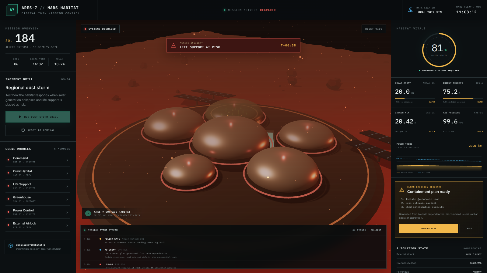
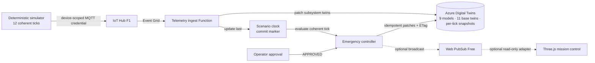
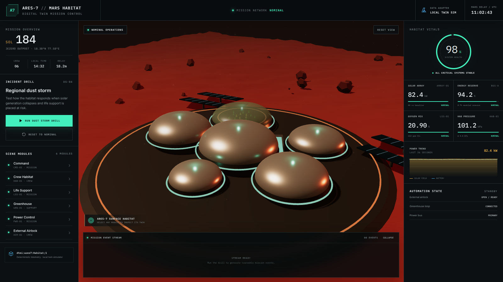
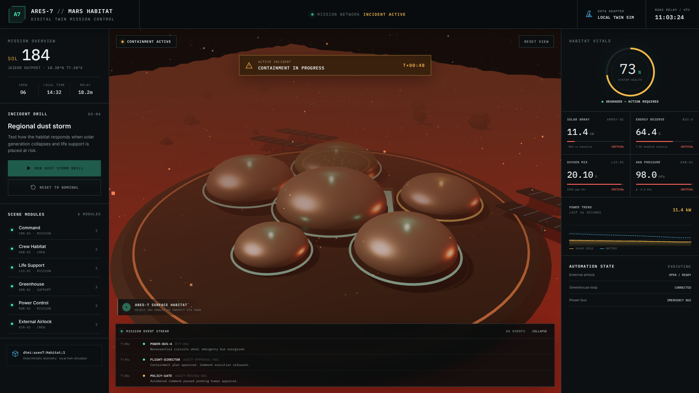

# ARES-7 — Mars Habitat Digital Twin

[](https://github.com/JarthurLabs/ARES-7-Mars-Habitat-Digital-Twin/actions/workflows/ci.yml)
[](https://github.com/JarthurLabs/ARES-7-Mars-Habitat-Digital-Twin/actions/workflows/codeql.yml)
[](https://github.com/JarthurLabs/ARES-7-Mars-Habitat-Digital-Twin/actions/workflows/dependency-review.yml)

[Public replay target](https://jarthurlabs.github.io/ARES-7-Mars-Habitat-Digital-Twin/) — publication is waiting for GitHub Pages to be enabled with **GitHub Actions** as its source. The artifact is a deterministic static build and does not pretend to be live Azure data.

ARES-7 is an Azure portfolio lab that turns a deterministic Martian
dust storm into a traceable, human-approved containment sequence across a
modeled habitat.



_The running local simulator at its approval boundary. The current capture
shows the real model identifier and distinguishes six visible scene modules
from the 11 entities defined for the twin graph._

The interesting question is not whether a dashboard can turn red. It is
whether an event-driven controller can act on a coherent snapshot, reject
duplicate delivery, and stop before a consequential action. ARES-7 makes those
decisions visible.

## At a glance

- 9 DTDL v2 interfaces.
- 11 digital-twin definitions and 15 relationship definitions.
- 12 deterministic raw telemetry ticks.
- One 8-state controller shared by the local replay and Functions.
- 76 checks: 70 viewer/shared-core, simulator, and Function tests plus 6 browser tests.
- One explicit human approval gate before containment.
- IoT Hub `F1` and Web PubSub `Free_F1` enforced in Bicep.

## What happens during the drill

1. A deterministic simulator introduces rising dust opacity.
2. Solar generation falls and the battery begins discharging.
3. Oxygen production and reserve cross the life-support threshold.
4. Automation pauses at `LIFE_SUPPORT_RISK`.
5. The operator may approve containment or hold the plan.
6. Only after approval may the controller isolate noncritical modules, seal the
   airlock, shed load, and prioritize life support.
7. Stable recovery readings are required before restoration and resolution.

The raw simulators never assume that approval occurred. They report environment
and subsystem readings; one shared controller package owns commanded effects for
both the local replay and Azure Functions.

## Architecture



The simulator sends one aggregate message for each scenario tick. The ingest
Function validates and hashes it, creates an immutable snapshot twin, stamps
every projection with the same run/tick/version, then updates `ares7-clock`
last using its ETag. If a projection falls over halfway through, the clock does
not pretend everything is fine. A same-payload retry can finish the work.

The controller ignores unrelated twin noise. For clock events it reads the
exact immutable snapshot named by the commit marker and catches up any missing
ticks in order. For approval events it uses a separate decision and action ID,
so approval after the final telemetry tick runs immediately. Each actuator
write is ETag guarded and resumable; the habitat commits last, and Web PubSub
broadcasts only the state that actually stuck.

See [the architecture notes](docs/architecture.md) for the trust boundaries,
graph, and implementation status.

## Safety and reliability choices

- Aggregate telemetry defines a clear consistency boundary and stable hash.
- An immutable twin preserves each accepted run/tick payload.
- The clock twin is ETag committed only after every projection is stamped.
- At-least-once delivery is expected; duplicate and older ticks are ignored.
- A conflicting habitat write fails rather than silently overwriting newer
  state.
- Partial commands converge by action ID instead of replaying finished writes.
- A Web PubSub failure cannot roll back authoritative twin state.
- Service clients use `DefaultAzureCredential`; no owner key is stored in code.
- The simulator accepts only a device-scoped IoT credential at runtime.
- The containment plan cannot execute while the operator decision is pending.
- Cost-sensitive SKUs fail closed instead of falling back to paid tiers.

## Current implementation status

| Component | Status | Evidence |
|---|---|---|
| Interactive Three.js habitat | Responsive local replay | Genuine 1600×900 and 390×844 captures plus browser tests |
| Local incident and approval UI | Working locally through the shared reducer | Viewer and local-adapter tests |
| Deterministic telemetry simulator | Working locally | 12-frame NDJSON and 3 tests |
| DTDL graph definition | Defined locally | 9 interfaces, 11 base twins, 15 relationships, and per-tick snapshots |
| Ingest and controller Functions | Build and test locally | Shared-core plus handler integration and failure-injection tests |
| Core Bicep | Built, validated, reviewed with What-If, and deployed | Deployment `ares7-core-20260731` succeeded |
| Azure resource group | Live and tagged | `rg-ares7-lab-eus2` |
| Azure core services | **Deployed** | Digital Twins, IoT Hub F1, Web PubSub Free_F1, and Standard LRS Storage |
| Azure event path | **Pending** | Functions, Event Grid, RBAC, graph upload, and device identity are not yet live |
| Static public replay | Workflow ready; repository Pages setting still needs enabling | Validated `dist`-only workflow and artifact guard |
| Web PubSub browser adapter | Optional and read-only | UI defaults to `LOCAL REPLAY`; live mode needs a short-lived receive-only negotiate URL |
| Azure 3D Scenes Studio asset | Planned | Current scene is procedural Three.js |

The core deployment is genuine Azure state and is preserved in redacted CLI
captures and a deployment record. It proves the resource and SKU boundary; it
does not prove the still-pending telemetry and controller integration.

## Run it locally

Use Node.js 22 and install each package once:

```bash
npm ci
npm --prefix simulator ci
npm --prefix functions ci
npm run verify
```

Start the viewer:

```bash
npm run dev
```

Open the URL printed by Vite, run the dust-storm drill, and inspect the event
stream when the simulation pauses at the approval gate. The detailed sequence
is in the [demo runbook](docs/demo-runbook.md).

The static replay requires no install. Its data-source chip, run ID, tick,
snapshot version, and controller state stay visible so a reviewer can tell
exactly what the screen is showing. Select a habitat module to open the twin
inspector; arrow keys move through the module list and `Escape` closes it.

Generate a network-free telemetry run:

```bash
npm --prefix simulator run dry-run
```

## Evidence

| Nominal | Approval required | Containment active |
|---|---|---|
| [](evidence/screenshots/ares7-nominal.png) | [](evidence/screenshots/ares7-human-approval-gate.png) | [](evidence/screenshots/ares7-containment-active.png) |

The current public-demo captures are [desktop with the twin inspector](evidence/screenshots/ares7-public-demo-desktop-20260805.png) and [mobile at 390×844](evidence/screenshots/ares7-public-demo-mobile-20260805.png). They were produced through the built application, not assembled in an image editor.

The [evidence register](evidence/README.md) separates verified local behavior,
verified Azure core infrastructure, and pending integration proof. An item is
marked verified only when its corresponding artifact exists.

## Cost controls and cleanup

The target is a short evidence run under $10, with a planned $25 Azure budget
alert as a secondary warning. Budget alerts are delayed notifications, not
hard spending caps. The template excludes VMs, Kubernetes, Cosmos DB, Azure
Data Explorer, private endpoints, and paid AI services.

The exact cost boundary and resource-group deletion checklist are documented
in [cost and cleanup](docs/cost-and-cleanup.md). The tagged resource group is
scheduled for deletion within 72 hours of the final evidence capture.

## What this lab does not claim

ARES-7 is a portfolio lab, not a production safety system. Its telemetry is
synthetic and deterministic; it is not connected to spacecraft hardware. The
current browser experience uses a local data adapter. The Azure core exists,
but Functions deployment, Event Grid routes, RBAC assignments, data-plane
models and twins, device provisioning, and live Web PubSub integration remain
pending until their evidence is present.

The lab template permits public service endpoints to keep the first deployment
understandable and inexpensive. It has not undergone penetration, load,
availability, or disaster-recovery testing. The procedural Three.js habitat is
separate from a future Azure 3D Scenes Studio asset.

## Repository map

```text
src/         Three.js habitat, mission-control UI, and local controller adapter
packages/    Source-only controller contracts, thresholds, transitions, and commands
simulator/   Deterministic aggregate telemetry and device-side sender
models/      DTDL v2 interfaces, immutable snapshot model, and base twin graph
functions/   Ingest Function, controller, tests, and graph scripts
infra/       Cost-gated core Azure Bicep
docs/        Architecture, runbook, incident journal, and cost controls
evidence/    Genuine local captures, verification logs, and evidence register
```

The [incident journal](docs/incident-journal.md) records real mistakes and
their fixes, including external-font capture failures, the CommonJS/ESM SDK
boundary, raw telemetry that originally assumed approval, and two issues found
by real Azure Bicep validation.

## License

[MIT](LICENSE) © 2026 Jamal Arthur.
