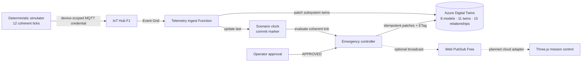

# ARES-7 — Mars Habitat Digital Twin

ARES-7 is an Azure portfolio lab that turns a deterministic Martian
dust storm into a traceable, human-approved containment sequence across a
modeled habitat.


_The running local simulator at its approval boundary. The current capture
shows the real model identifier and distinguishes six visible scene modules
from the 11 entities defined for the twin graph._

The interesting question is not whether a dashboard can turn red. It is
whether an event-driven controller can act on a coherent snapshot, reject
duplicate delivery, and stop before a consequential action. ARES-7 makes those
decisions visible.

## At a glance

- 8 DTDL v2 interfaces.
- 11 digital-twin definitions and 15 relationship definitions.
- 12 deterministic raw telemetry ticks.
- An 8-state cloud controller with one transition per tick.
- 10 tests across the viewer, simulator, and controller.
- One explicit human approval gate before containment.
- IoT Hub `F1` and Web PubSub `Free_F1` enforced in Bicep.

## What happens during the drill

1. A deterministic simulator introduces rising dust opacity.
2. Solar generation falls and the battery begins discharging.
3. Oxygen production and reserve cross the life-support threshold.
4. Automation pauses at `LIFE_SUPPORT_RISK`.
5. The operator may approve containment or hold the plan.
6. Only after approval may the controller isolate noncritical modules, seal the
   airlock, shed load, and prioritize life support.
7. Stable recovery readings are required before restoration and resolution.

The raw simulator never assumes that approval occurred. It reports environment
and subsystem readings; the controller owns commanded effects.

## Architecture



The simulator sends one aggregate message for each scenario tick. The ingest
Function validates its schema, updates environment, power, life-support, and
module twins, then updates `ares7-clock` last. That clock update is the commit
marker for a coherent snapshot.

The controller ignores non-clock events. It identifies work by scenario run
and tick, rejects duplicate or older ticks, permits only one state transition
per tick, and updates the habitat twin using its ETag. At the life-support
boundary it records `operatorDecision=PENDING` and applies no containment
controls. Approval is also ETag guarded.

See [the architecture notes](docs/architecture.md) for the trust boundaries,
graph, and implementation status.

## Safety and reliability choices

- Aggregate telemetry defines a clear consistency boundary.
- The clock twin is updated only after every subsystem reading for a tick.
- At-least-once delivery is expected; duplicate and older ticks are ignored.
- A conflicting habitat write fails rather than silently overwriting newer
  state.
- Service clients use `DefaultAzureCredential`; no owner key is stored in code.
- The simulator accepts only a device-scoped IoT credential at runtime.
- The containment plan cannot execute while the operator decision is pending.
- Cost-sensitive SKUs fail closed instead of falling back to paid tiers.

## Current implementation status

| Component | Status | Evidence |
|---|---|---|
| Interactive Three.js habitat | Working locally | Three genuine 1600×900 captures |
| Local incident and approval UI | Working locally | Viewer tests and drill captures |
| Deterministic telemetry simulator | Working locally | 12-frame NDJSON and 3 tests |
| DTDL graph definition | Defined locally | 8 interfaces, 11 twins, 15 relationships |
| Ingest and controller Functions | Build and test locally | 4 state-machine tests |
| Core Bicep | Built, validated, reviewed with What-If, and deployed | Deployment `ares7-core-20260731` succeeded |
| Azure resource group | Live and tagged | `rg-ares7-lab-eus2` |
| Azure core services | **Deployed** | Digital Twins, IoT Hub F1, Web PubSub Free_F1, and Standard LRS Storage |
| Azure event path | **Pending** | Functions, Event Grid, RBAC, graph upload, and device identity are not yet live |
| Web PubSub browser adapter | Planned | Current UI says `LOCAL TWIN SIM` |
| Azure 3D Scenes Studio asset | Planned | Current scene is procedural Three.js |

The core deployment is genuine Azure state and is preserved in redacted CLI
captures and a deployment record. It proves the resource and SKU boundary; it
does not prove the still-pending telemetry and controller integration.

## Run it locally

Use Node.js 22 and install each package once:

```bash
npm ci
npm --prefix simulator ci
npm --prefix functions ci
npm run verify
```

Start the viewer:

```bash
npm run dev
```

Open the URL printed by Vite, run the dust-storm drill, and inspect the event
stream when the simulation pauses at the approval gate. The detailed sequence
is in the [demo runbook](docs/demo-runbook.md).

Generate a network-free telemetry run:

```bash
npm --prefix simulator run dry-run
```

## Evidence

| Nominal | Approval required | Containment active |
|---|---|---|
| [](evidence/screenshots/ares7-nominal.png) | [](evidence/screenshots/ares7-human-approval-gate.png) | [](evidence/screenshots/ares7-containment-active.png) |

The [evidence register](evidence/README.md) separates verified local behavior,
verified Azure core infrastructure, and pending integration proof. An item is
marked verified only when its corresponding artifact exists.

## Cost controls and cleanup

The target is a short evidence run under $10, with a planned $25 Azure budget
alert as a secondary warning. Budget alerts are delayed notifications, not
hard spending caps. The template excludes VMs, Kubernetes, Cosmos DB, Azure
Data Explorer, private endpoints, and paid AI services.

The exact cost boundary and resource-group deletion checklist are documented
in [cost and cleanup](docs/cost-and-cleanup.md). The tagged resource group is
scheduled for deletion within 72 hours of the final evidence capture.

## What this lab does not claim

ARES-7 is a portfolio lab, not a production safety system. Its telemetry is
synthetic and deterministic; it is not connected to spacecraft hardware. The
current browser experience uses a local data adapter. The Azure core exists,
but Functions deployment, Event Grid routes, RBAC assignments, data-plane
models and twins, device provisioning, and live Web PubSub integration remain
pending until their evidence is present.

The lab template permits public service endpoints to keep the first deployment
understandable and inexpensive. It has not undergone penetration, load,
availability, or disaster-recovery testing. The procedural Three.js habitat is
separate from a future Azure 3D Scenes Studio asset.

## Repository map

```text
src/         Three.js habitat, mission-control UI, and local incident model
simulator/   Deterministic aggregate telemetry and device-side sender
models/      DTDL v2 interfaces and the defined twin graph
functions/   Ingest Function, controller, tests, and graph scripts
infra/       Cost-gated core Azure Bicep
docs/        Architecture, runbook, incident journal, and cost controls
evidence/    Genuine local captures, verification logs, and evidence register
```

The [incident journal](docs/incident-journal.md) records real mistakes and
their fixes, including external-font capture failures, the CommonJS/ESM SDK
boundary, raw telemetry that originally assumed approval, and two issues found
by real Azure Bicep validation.

## License

[MIT](LICENSE) © 2026 Jamal Arthur.
