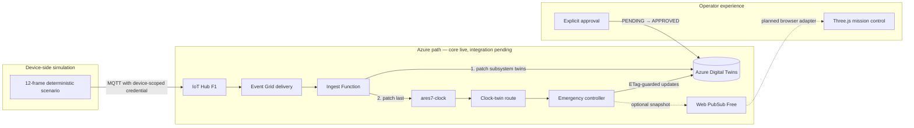
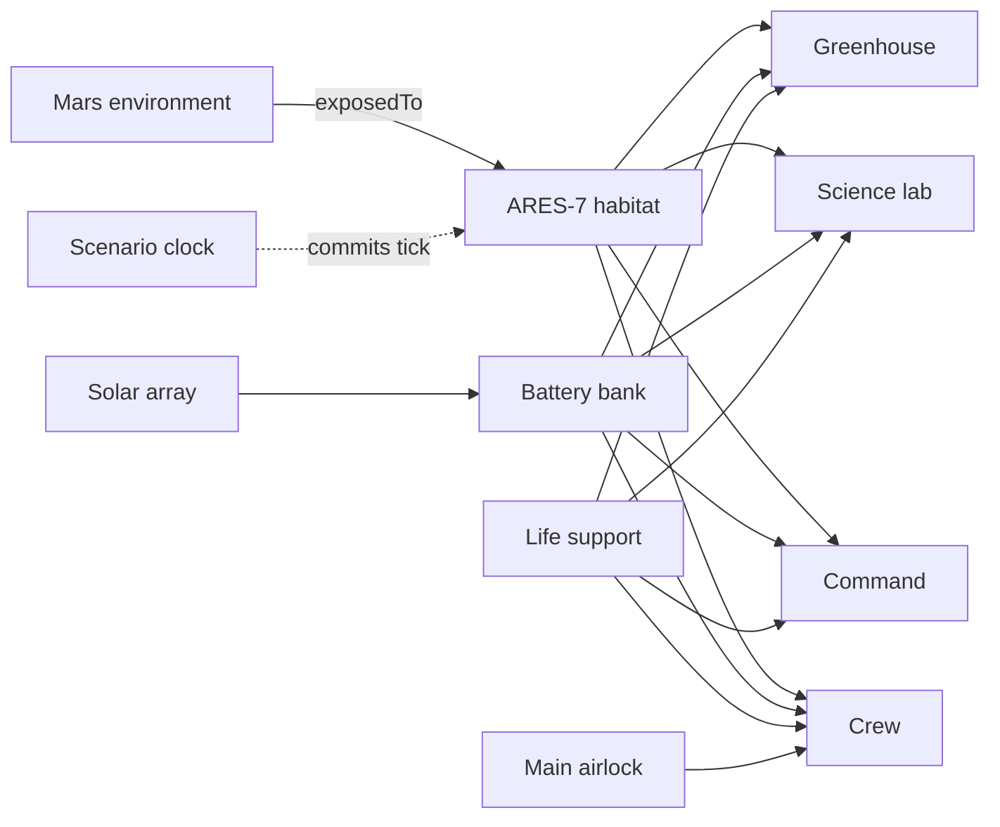
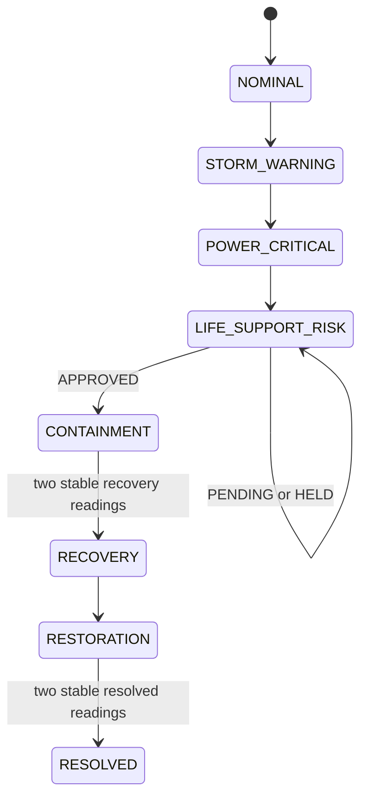

# Architecture

ARES-7 separates three concerns: generating a repeatable incident, maintaining
a coherent digital-twin snapshot, and deciding when automation is allowed to
act. The viewer makes those decisions visible, but it is not treated as the
source of truth.

## Design goals

- Reproduce the same failure boundary on every run.
- Model dependencies between environment, power, life support, and habitat
  modules instead of keeping every metric in one object.
- Handle Azure's at-least-once event delivery without repeating a transition.
- Prevent the controller from evaluating a partially updated tick.
- Require an explicit person to approve containment.
- Keep the first Azure evidence run inexpensive and easy to remove.

Production safety certification, physical-device integration, high
availability, private networking, and autonomous recovery are outside the
current scope.

## Components and current reality

| Component | Responsibility | Current state |
|---|---|---|
| Three.js viewer | Visualize the habitat, telemetry, events, and approval boundary | Runs locally through the shared controller package |
| Telemetry simulator | Produce 12 deterministic aggregate readings | Runs and tests locally; IoT sender implemented |
| DTDL models | Describe eight domain interfaces | Defined locally |
| Twin graph | Describe 11 twin instances and 15 relationships | Defined locally; not uploaded yet |
| Ingest Function | Validate one message and patch subsystem twins | Builds and tests locally; not deployed |
| Scenario clock | Mark a complete tick after subsystem updates | Defined locally; not created in Azure yet |
| Emergency controller | Evaluate one guarded state transition through the shared package | Builds and tests locally; not deployed |
| Bicep | Create the cost-gated core services | Built, validated, reviewed, and deployed |
| Azure resource group | Bound cost, tags, and cleanup | `rg-ares7-lab-eus2` exists and is tagged |
| Azure core services | Provide ADT, IoT, PubSub, and Storage | Deployed; free/cost-gated SKUs verified |
| Azure routes and compute | Carry and evaluate the live scenario | Pending deployment |

## Target event path

Solid arrows describe the implemented target flow. The four core Azure services
exist, but the routes, Functions, data-plane graph, and device are not yet live.
Dotted arrows are planned integration.

## Twin graph

The graph uses eight DTDL v2 interfaces, 11 twin instances, and 15
relationships.

The complete machine-readable definitions are in
[`models/ares7-models.json`](../models/ares7-models.json) and
[`models/twin-graph.json`](../models/twin-graph.json). Current readings are
writable properties so they can be queried and used by a future 3D Scenes
Studio behavior layer.

## Coherent ticks

Each simulator message includes a `scenarioRunId`, monotonically increasing
`tick`, simulated time, and grouped environment, power, and life-support
readings. One aggregate message is deliberate: it defines which readings
belong together before the ingest Function fans them out.

The ingest sequence is:

1. Validate schema version, message type, run ID, tick, and required sections.
2. Patch environment, solar, battery, life-support, and module twins.
3. Patch `ares7-clock` only after every preceding update succeeds.

The clock is therefore a commit marker. A controller triggered by a subsystem
update could see a mixture of old and new values; a controller triggered by
the clock sees the completed tick.

## Controller and approval boundary

Only one transition is permitted per tick. The controller compares the clock
tick with the habitat's `lastProcessedTick`; duplicate and older work is
ignored. The final habitat patch carries its ETag, so a concurrent change fails
instead of silently overwriting newer state.

Entering `LIFE_SUPPORT_RISK` sets `operatorDecision=PENDING`. No lab isolation,
greenhouse isolation, airlock seal, load shed, or life-support priority command
is applied in that state. The approval script first verifies the exact state
and decision, then updates the twin with the same ETag protection. A later
clock event can advance the controller into containment.

The raw simulator deliberately does not lower bus demand or increase allocated
life-support power. Those are commanded effects and belong to the controller.

## Identity and trust boundaries

- The simulator receives one device-scoped IoT Hub credential through the
  environment. An owner connection string is neither required nor accepted by
  the documented workflow.
- Functions use `DefaultAzureCredential` for Digital Twins and optional Web
  PubSub access. Required managed-identity role assignments have not yet been
  applied because the Functions integration is still pending.
- Web PubSub local-key authentication is disabled in Bicep.
- Storage shared-key access and anonymous blob access are disabled. The scene
  and evidence containers are private.
- Public network endpoints remain enabled for the learning lab. Private
  endpoints are intentionally excluded from the first cost envelope.

## Deployment boundary

The current Bicep creates only the core Azure services: Digital Twins, IoT Hub
F1, Web PubSub Free_F1, and Standard LRS Storage with two private containers.
It does not yet declare the Function App, Event Grid subscriptions, Digital
Twins routes, RBAC assignments, device identity, budget, DTDL models, or graph.

That boundary is intentional and visible. The tagged resource group and core
services are live; integration and end-to-end event evidence remain pending.

## Known limitations

- The local UI and Functions use one reducer, but their I/O adapters remain
  separate and the Azure adapter is not deployed yet.
- The viewer does not consume Web PubSub or Azure Digital Twins yet.
- The current 3D habitat is generated with Three.js rather than loaded from an
  Azure 3D Scenes Studio GLB.
- Recovery readings are scripted rather than produced by a feedback model.
- There is no production observability, retry/dead-letter runbook, performance
  test, disaster recovery, or formal threat model.
- Installation currently reports deprecation notices from dependencies pulled
  transitively by the Azure IoT device SDK. These are tracked as dependency
  debt and are not represented as direct confirmed vulnerabilities.
