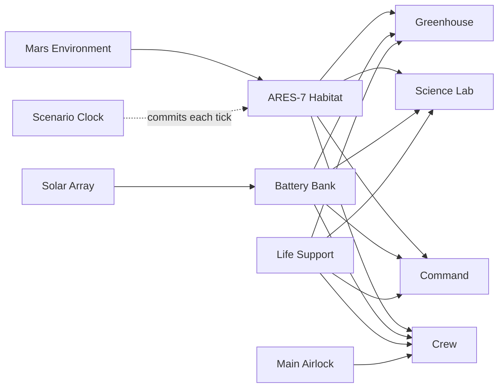

# Digital twin models

These are local, machine-readable definitions for the planned graph. They
have not yet been uploaded to the Azure Digital Twins instance.

The graph uses DTDL version 2 because Azure Digital Twins Explorer currently gives it the strongest model-graph support.

The `ScenarioClock` twin is deliberately separate. The ingest path updates every sensor and subsystem twin first, then patches the clock last. Downstream automation reacts to the clock update as the commit marker for a coherent tick. This prevents the emergency controller from evaluating a half-updated habitat.

Current telemetry is represented as writable properties instead of DTDL telemetry fields so it remains queryable and can drive 3D Scenes Studio behaviors.

## Graph

