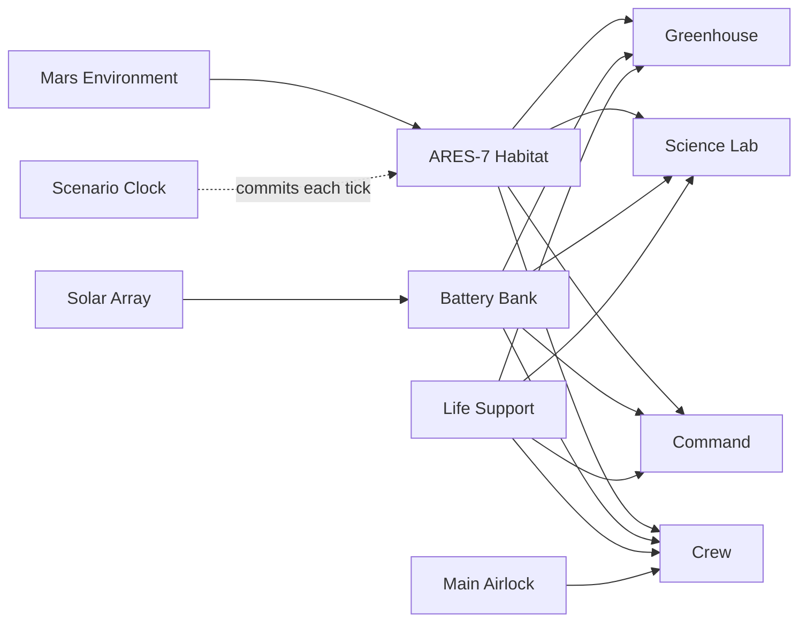

# Digital twin models

These are local, machine-readable definitions for the planned graph. They
have not yet been uploaded to the Azure Digital Twins instance.

The graph uses DTDL version 2 because Azure Digital Twins Explorer currently gives it the strongest model-graph support.

The ninth interface is an immutable `TelemetrySnapshot`. Ingest creates one
snapshot twin per accepted run and tick, stamps every mutable projection with
the same identity and payload hash, then updates `ScenarioClock` last with an
ETag check. The 11 twins in `twin-graph.json` are the reusable base graph;
snapshot twins are created as telemetry arrives.

This closes the ingest-side partial-write gap. The controller still reads the
mutable projection twins until the next milestone moves it to exact snapshot
loading, so this repository does not yet claim an end-to-end coherent cloud
controller. Mars is hard enough without optimistic documentation.

Current projections are writable properties so they remain queryable and can
drive 3D Scenes Studio behaviors. Snapshot properties omit `writable`, and the
ingest port only offers create-once behavior for accepted history. Azure RBAC
still matters; a sufficiently privileged client could edit a twin directly.

## Graph

